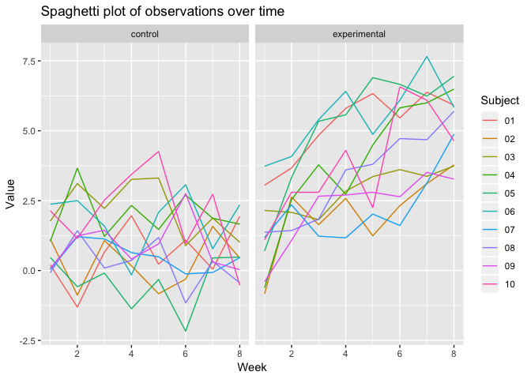

p8105\_hw5\_tm2680
================
Tatini Mal-Sarkar
11/5/2018

Problem 1
=========

``` r
output = 
  tibble(long_data = list.files(path = "./data", full.names = TRUE)) %>% 
  mutate(long_data_df = map(long_data, read_csv)) %>% 
  unnest() %>% 
  mutate(arm = str_sub(long_data, 8, 10),
         arm = replace(arm, arm == "con", "control"),
         arm = replace(arm, arm == "exp", "experimental")) %>% 
  mutate(number = str_sub(long_data, 12, 13)) %>% 
  select(arm, number, everything()) %>% 
  gather(week_1:week_8, key = "week", value = "value") %>%
  janitor::clean_names() %>% 
  separate(week, into = c("drop_var", "week"), sep = "_") %>% 
  select(-drop_var) %>% 
  mutate(week = as.numeric(week))
```

    ## Parsed with column specification:
    ## cols(
    ##   week_1 = col_double(),
    ##   week_2 = col_double(),
    ##   week_3 = col_double(),
    ##   week_4 = col_double(),
    ##   week_5 = col_double(),
    ##   week_6 = col_double(),
    ##   week_7 = col_double(),
    ##   week_8 = col_double()
    ## )
    ## Parsed with column specification:
    ## cols(
    ##   week_1 = col_double(),
    ##   week_2 = col_double(),
    ##   week_3 = col_double(),
    ##   week_4 = col_double(),
    ##   week_5 = col_double(),
    ##   week_6 = col_double(),
    ##   week_7 = col_double(),
    ##   week_8 = col_double()
    ## )
    ## Parsed with column specification:
    ## cols(
    ##   week_1 = col_double(),
    ##   week_2 = col_double(),
    ##   week_3 = col_double(),
    ##   week_4 = col_double(),
    ##   week_5 = col_double(),
    ##   week_6 = col_double(),
    ##   week_7 = col_double(),
    ##   week_8 = col_double()
    ## )
    ## Parsed with column specification:
    ## cols(
    ##   week_1 = col_double(),
    ##   week_2 = col_double(),
    ##   week_3 = col_double(),
    ##   week_4 = col_double(),
    ##   week_5 = col_double(),
    ##   week_6 = col_double(),
    ##   week_7 = col_double(),
    ##   week_8 = col_double()
    ## )
    ## Parsed with column specification:
    ## cols(
    ##   week_1 = col_double(),
    ##   week_2 = col_double(),
    ##   week_3 = col_double(),
    ##   week_4 = col_double(),
    ##   week_5 = col_double(),
    ##   week_6 = col_double(),
    ##   week_7 = col_double(),
    ##   week_8 = col_double()
    ## )
    ## Parsed with column specification:
    ## cols(
    ##   week_1 = col_double(),
    ##   week_2 = col_double(),
    ##   week_3 = col_double(),
    ##   week_4 = col_double(),
    ##   week_5 = col_double(),
    ##   week_6 = col_double(),
    ##   week_7 = col_double(),
    ##   week_8 = col_double()
    ## )
    ## Parsed with column specification:
    ## cols(
    ##   week_1 = col_double(),
    ##   week_2 = col_double(),
    ##   week_3 = col_double(),
    ##   week_4 = col_double(),
    ##   week_5 = col_double(),
    ##   week_6 = col_double(),
    ##   week_7 = col_double(),
    ##   week_8 = col_double()
    ## )
    ## Parsed with column specification:
    ## cols(
    ##   week_1 = col_double(),
    ##   week_2 = col_double(),
    ##   week_3 = col_double(),
    ##   week_4 = col_double(),
    ##   week_5 = col_double(),
    ##   week_6 = col_double(),
    ##   week_7 = col_double(),
    ##   week_8 = col_double()
    ## )
    ## Parsed with column specification:
    ## cols(
    ##   week_1 = col_double(),
    ##   week_2 = col_double(),
    ##   week_3 = col_double(),
    ##   week_4 = col_double(),
    ##   week_5 = col_double(),
    ##   week_6 = col_double(),
    ##   week_7 = col_double(),
    ##   week_8 = col_double()
    ## )
    ## Parsed with column specification:
    ## cols(
    ##   week_1 = col_double(),
    ##   week_2 = col_double(),
    ##   week_3 = col_double(),
    ##   week_4 = col_double(),
    ##   week_5 = col_double(),
    ##   week_6 = col_double(),
    ##   week_7 = col_double(),
    ##   week_8 = col_double()
    ## )
    ## Parsed with column specification:
    ## cols(
    ##   week_1 = col_double(),
    ##   week_2 = col_double(),
    ##   week_3 = col_double(),
    ##   week_4 = col_double(),
    ##   week_5 = col_double(),
    ##   week_6 = col_double(),
    ##   week_7 = col_double(),
    ##   week_8 = col_double()
    ## )
    ## Parsed with column specification:
    ## cols(
    ##   week_1 = col_double(),
    ##   week_2 = col_double(),
    ##   week_3 = col_double(),
    ##   week_4 = col_double(),
    ##   week_5 = col_double(),
    ##   week_6 = col_double(),
    ##   week_7 = col_double(),
    ##   week_8 = col_double()
    ## )
    ## Parsed with column specification:
    ## cols(
    ##   week_1 = col_double(),
    ##   week_2 = col_double(),
    ##   week_3 = col_double(),
    ##   week_4 = col_double(),
    ##   week_5 = col_double(),
    ##   week_6 = col_double(),
    ##   week_7 = col_double(),
    ##   week_8 = col_double()
    ## )

    ## Parsed with column specification:
    ## cols(
    ##   week_1 = col_double(),
    ##   week_2 = col_double(),
    ##   week_3 = col_double(),
    ##   week_4 = col_double(),
    ##   week_5 = col_double(),
    ##   week_6 = col_double(),
    ##   week_7 = col_integer(),
    ##   week_8 = col_double()
    ## )

    ## Parsed with column specification:
    ## cols(
    ##   week_1 = col_double(),
    ##   week_2 = col_double(),
    ##   week_3 = col_double(),
    ##   week_4 = col_double(),
    ##   week_5 = col_double(),
    ##   week_6 = col_double(),
    ##   week_7 = col_double(),
    ##   week_8 = col_double()
    ## )
    ## Parsed with column specification:
    ## cols(
    ##   week_1 = col_double(),
    ##   week_2 = col_double(),
    ##   week_3 = col_double(),
    ##   week_4 = col_double(),
    ##   week_5 = col_double(),
    ##   week_6 = col_double(),
    ##   week_7 = col_double(),
    ##   week_8 = col_double()
    ## )
    ## Parsed with column specification:
    ## cols(
    ##   week_1 = col_double(),
    ##   week_2 = col_double(),
    ##   week_3 = col_double(),
    ##   week_4 = col_double(),
    ##   week_5 = col_double(),
    ##   week_6 = col_double(),
    ##   week_7 = col_double(),
    ##   week_8 = col_double()
    ## )
    ## Parsed with column specification:
    ## cols(
    ##   week_1 = col_double(),
    ##   week_2 = col_double(),
    ##   week_3 = col_double(),
    ##   week_4 = col_double(),
    ##   week_5 = col_double(),
    ##   week_6 = col_double(),
    ##   week_7 = col_double(),
    ##   week_8 = col_double()
    ## )
    ## Parsed with column specification:
    ## cols(
    ##   week_1 = col_double(),
    ##   week_2 = col_double(),
    ##   week_3 = col_double(),
    ##   week_4 = col_double(),
    ##   week_5 = col_double(),
    ##   week_6 = col_double(),
    ##   week_7 = col_double(),
    ##   week_8 = col_double()
    ## )
    ## Parsed with column specification:
    ## cols(
    ##   week_1 = col_double(),
    ##   week_2 = col_double(),
    ##   week_3 = col_double(),
    ##   week_4 = col_double(),
    ##   week_5 = col_double(),
    ##   week_6 = col_double(),
    ##   week_7 = col_double(),
    ##   week_8 = col_double()
    ## )

``` r
output %>% 
  ggplot(aes(x = week, y = value, color = number)) +
  geom_line() +
  labs(
    title = "Spaghetti plot of observations over time",
    x = "Week",
    y = "Value"
  ) +
  scale_color_hue(name = "Subject") +
  facet_grid(~ arm)
```



Here is a faceted spaghetti plot showing observations for each subject over a period of 8 weeks. On average, it looks like the values for the experimental group increased over time, whereas the values stayed roughly the same for the control group.

Problem 2
=========

``` r
hom_url = "https://raw.githubusercontent.com/washingtonpost/data-homicides/master/homicide-data.csv"

hom_dat = read_csv(hom_url) %>% 
  mutate(city_state = str_c(city, ", ", state)) %>% 
  janitor::clean_names() 
```

    ## Parsed with column specification:
    ## cols(
    ##   uid = col_character(),
    ##   reported_date = col_integer(),
    ##   victim_last = col_character(),
    ##   victim_first = col_character(),
    ##   victim_race = col_character(),
    ##   victim_age = col_character(),
    ##   victim_sex = col_character(),
    ##   city = col_character(),
    ##   state = col_character(),
    ##   lat = col_double(),
    ##   lon = col_double(),
    ##   disposition = col_character()
    ## )

``` r
hom_dat_df = hom_dat %>% 
  group_by(city_state) %>% 
  summarize(hom = n(),
            hom_unsolv = sum(disposition == "Closed without arrest" | disposition == "Open/No arrest")) 

knitr::kable(hom_dat_df)
```

| city\_state        |   hom|  hom\_unsolv|
|:-------------------|-----:|------------:|
| Albuquerque, NM    |   378|          146|
| Atlanta, GA        |   973|          373|
| Baltimore, MD      |  2827|         1825|
| Baton Rouge, LA    |   424|          196|
| Birmingham, AL     |   800|          347|
| Boston, MA         |   614|          310|
| Buffalo, NY        |   521|          319|
| Charlotte, NC      |   687|          206|
| Chicago, IL        |  5535|         4073|
| Cincinnati, OH     |   694|          309|
| Columbus, OH       |  1084|          575|
| Dallas, TX         |  1567|          754|
| Denver, CO         |   312|          169|
| Detroit, MI        |  2519|         1482|
| Durham, NC         |   276|          101|
| Fort Worth, TX     |   549|          255|
| Fresno, CA         |   487|          169|
| Houston, TX        |  2942|         1493|
| Indianapolis, IN   |  1322|          594|
| Jacksonville, FL   |  1168|          597|
| Kansas City, MO    |  1190|          486|
| Las Vegas, NV      |  1381|          572|
| Long Beach, CA     |   378|          156|
| Los Angeles, CA    |  2257|         1106|
| Louisville, KY     |   576|          261|
| Memphis, TN        |  1514|          483|
| Miami, FL          |   744|          450|
| Milwaukee, wI      |  1115|          403|
| Minneapolis, MN    |   366|          187|
| Nashville, TN      |   767|          278|
| New Orleans, LA    |  1434|          930|
| New York, NY       |   627|          243|
| Oakland, CA        |   947|          508|
| Oklahoma City, OK  |   672|          326|
| Omaha, NE          |   409|          169|
| Philadelphia, PA   |  3037|         1360|
| Phoenix, AZ        |   914|          504|
| Pittsburgh, PA     |   631|          337|
| Richmond, VA       |   429|          113|
| Sacramento, CA     |   376|          139|
| San Antonio, TX    |   833|          357|
| San Bernardino, CA |   275|          170|
| San Diego, CA      |   461|          175|
| San Francisco, CA  |   663|          336|
| Savannah, GA       |   246|          115|
| St. Louis, MO      |  1677|          905|
| Stockton, CA       |   444|          266|
| Tampa, FL          |   208|           95|
| Tulsa, AL          |     1|            0|
| Tulsa, OK          |   583|          193|
| Washington, DC     |  1345|          589|

The raw data comprises observations on homicides in numerous cities, including date, victim name, race, and gender, location, and disposition. There are 52,179 observations. The above table shows the total number of homicides and number of unsolved homicides by city.

``` r
hom_dat_balt = hom_dat %>% 
  group_by(city_state) %>% 
  summarize(hom = n(),
            hom_unsolv = sum(disposition == "Closed without arrest" | disposition == "Open/No arrest")) %>% 
  filter(city_state == "Baltimore, MD") 

hom_balt_prop = prop.test(hom_dat_balt$hom_unsolv, hom_dat_balt$hom, p = NULL) %>% 
  broom::tidy() %>% 
  select(estimate, conf.low, conf.high)
```

``` r
prop_test_func = function(df) {
  y = prop.test(df$hom_unsolv, df$hom)
  
  broom::tidy(y) %>% 
  select(estimate, conf.low, conf.high)
}

hom_dat_city = hom_dat_df %>% 
  nest(hom_unsolv, hom) %>% 
  mutate(hom_dat_prop = map(data, prop_test_func)) %>% 
  unnest() %>% 
  janitor::clean_names() %>% 
  select(-hom_unsolv, -hom)
```

    ## Warning in prop.test(df$hom_unsolv, df$hom): Chi-squared approximation may
    ## be incorrect

Here is my tidy dataframe featuring the estimated proportion of unsolved homicides, alongside the corresponding confidence intervals.

``` r
hom_dat_city %>% 
  mutate(city_state = forcats::fct_reorder(city_state, estimate)) %>% 
  ggplot(aes(x = city_state, y = estimate)) +
  geom_point() +
  geom_errorbar(aes(x = city_state, ymin = conf_low, ymax = conf_high)) +
  labs(
    title = "Estimated proportion of unsolved homicides by city",
    x = "City",
    y = "Estimated proportion"
  ) +
  theme(axis.text.x = element_text(angle = 90))
```


This plot shows the estimates of proportion of unsolved crimes by city, including confidence intervals.
